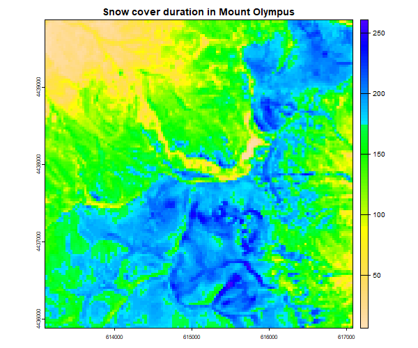

# snowman R package

The `snowman` package is designed to map snow cover dynamics across landscapes based on open optical satellite imagery at fine spatial resolutions. Current version can use Landsat satellite imagery available since 1984. This example will guide you through the process of using the package to extract Landsat imagery, calculate needed geospatial predictors, classify the imagery, and calculate snow variables.

The following code will introduce all the main functions of the package and produce the maps of snow conditions (such as snow cover duration) in Mount Olympos in Greece averaged over 2020-2024.

Note! High canopy cover of evergreen trees greatly lowers the accurracy of the algorhitm, thus interpret the results extra carefully if applying the method outside treeless regions.

## Prerequisites

Before you start, make sure you have the `snowman` package installed. You can install it from GitHub using the following command:

```r
# Install the snowman package from GitHub
devtools::install_github("PekkaNiittynen/snowman")
```

## Load required libraries

Load the necessary libraries, including `terra` and `snowman`.

```r
library(terra)
library(snowman)
```

## Set up parameters

Define the parameters for your analysis, including the base directory for Landsat imagery, the path for the pretrained models, the results path, the name of the site, and the area of interest (AOI).

```r
# Set the number of computer nodes to be utilized.
# Optimal number depends on your machine and the size of the AOI
n_workers <- 4 

base_landsat_path <- "C:/MyTemp/RS/" # Replace with your own path
model_path <- "C:/MyTemp/RS/"
results_path <- "C:/MyTemp/RS/"

site <- "Olympos" # Set a name for the area of interest
aoi_point <- list(lon = 22.349975, lat = 40.083285) # Set center point of the area of interest
buffer_size <- 2 # The size of a radiaus for a buffer drawn around the point in kilometers

starting_date <- "2020-01-01" # start date to download imager
ending_date <- "2024-12-31" # end date to download imager
```

## Extract landsat imagery

Use the `extract_landsat` function to extract Landsat imagery for the specified AOI and time period from Microsoft Planetary Computer with `rstac` package.

```r
system.time({
  image_df <- extract_landsat(aoi = aoi_point,
                              site_name = site,
                              aoi_size = buffer_size,
                              start_date = starting_date,
                              end_date = ending_date,
                              months = 1:12, # Which months to include
                              sats = c("LT04", "LT05", "LE07", "LC08", "LC09"),
                              minclouds = 50,
                              base_landsat_dir = base_landsat_path,
                              workers = n_workers)
})
```

## Search for existing image data frame

If the `extract_landsat` function was run earlier, you can use the `search_image_df` function to search for the existing imagery.

```r
# Start with this if 'extract_landsat' was run already earlier
if (!"image_df" %in% ls()) {
  image_df <- search_image_df(site_name = site, 
                              base_landsat_dir = base_landsat_path, 
                              workers = n_workers)
}
```

## Calculate predictors

Use the `calc_predictors` function to calculate the predictors for the extracted Landsat imagery.

```r
calc_predictors(image_df, site_name = site, base_landsat_dir = base_landsat_path)
```

## Download pretrained classifier models

Download the pretrained Random Forest classifier models using the `download_model` function.
List all satellites you plan to include in the analyses (i.e., present in the downloaded imagery)

```r
download_model(model_names = c("TM04", "TM05", "LE07", "LC08", "LC09"),
               model_dir = model_path)
```

## Classify imagery

Use the `classify_landsat` function to classify the Landsat imagery using the downloaded models to snowy, snowfree and cloudy pixels.

```r
system.time({
  lss <- classify_landsat(image_df, site_name = site, 
                          base_landsat_dir = base_landsat_path, 
                          model_dir = model_path, 
                          workers = n_workers)
})
```

## Calculate snow variables

Use the `calc_snow_variables` function to calculate the snow variables across the AOI.

```r
system.time({
  snow_vars <- calc_snow_variables(image_df, 
                                   site_name = site, 
                                   base_landsat_dir = base_landsat_path, 
                                   workers = n_workers)
})
```

## Visualize and save results

Plot the snow melting day (SCD) raster and save the results.

```r
plot(snow_vars$scd, col = rev(topo.colors(100)), main = "Snow cover duration in Mount Olympus")

writeRaster(snow_vars, paste0(base_landsat_path, "/", site, "/", "snow_variables.tif"), datatype = "FLT4S")
```



## Citation

The paper describing the package will be available soon!

In the meanwhile, for more information, please refer to the package documentation.
```